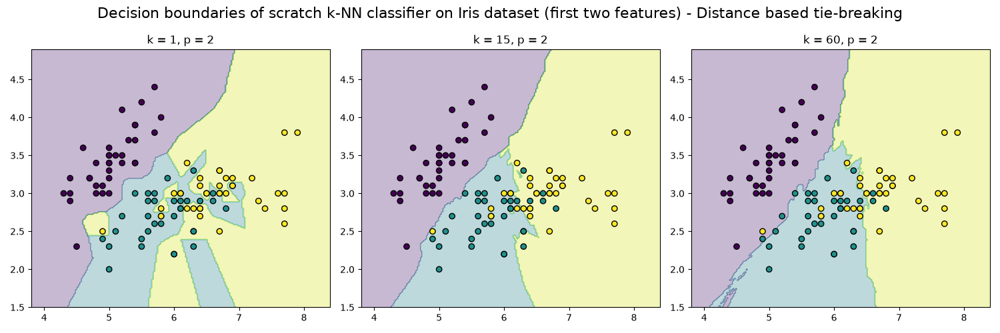
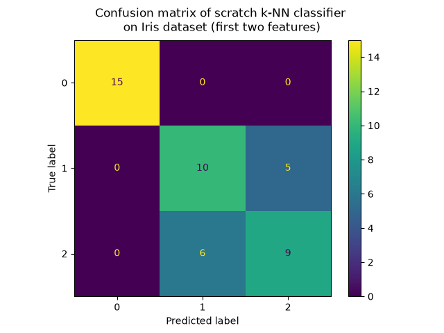
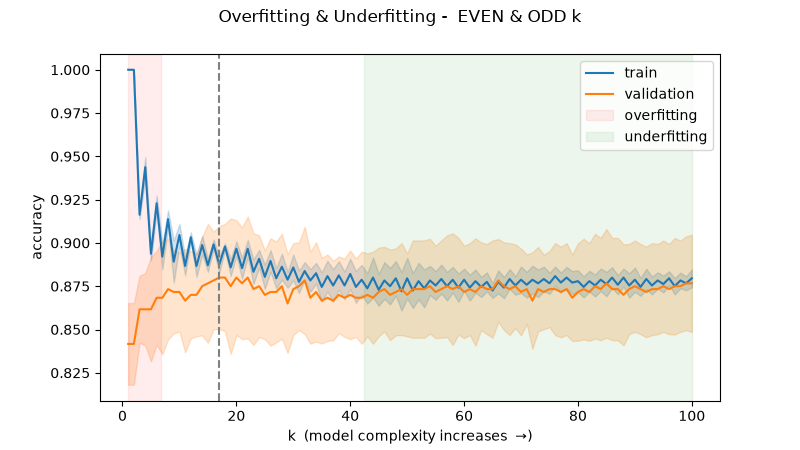
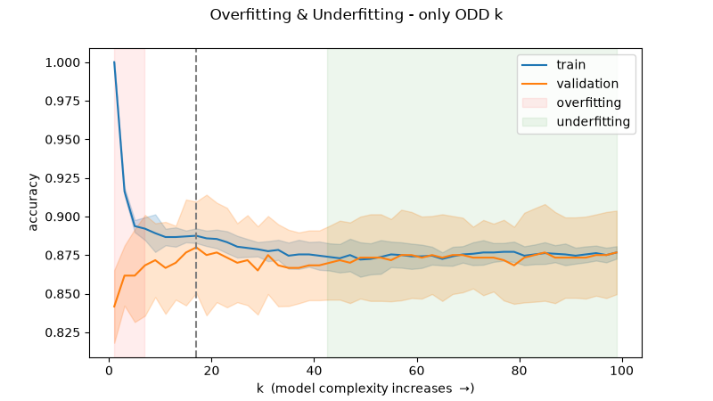
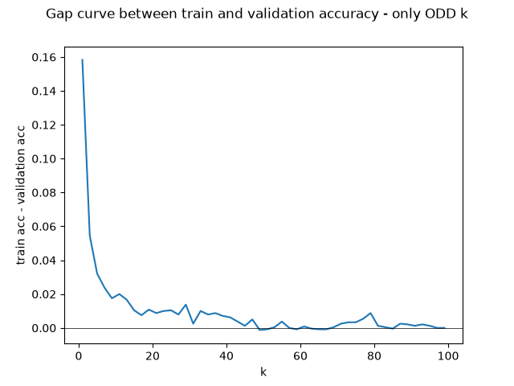
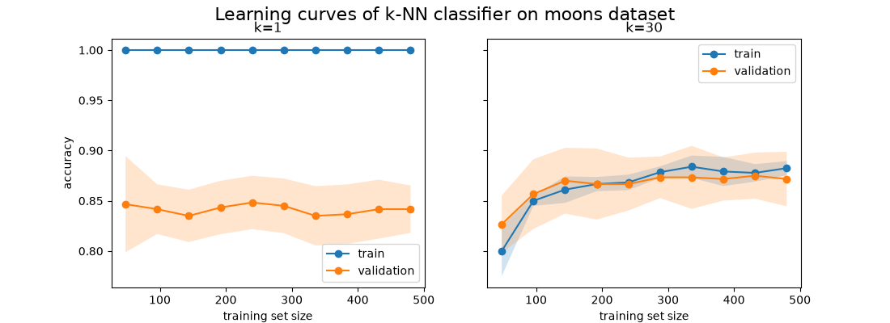

[//]: # ( ***

***)

# k-Nearest Neighbour

---
#### TODO
1. Verify/quantify/visualize: "1-NN has zero training error and tends to overfit noise".

---

### Roadmap
| Part | Topic                                                    | Coding-Style |
|------|----------------------------------------------------------|--------------|
| 1    | 1-NN, Voronoi, k-NN classification/regression, Minkowski | From-scratch |

 k-Nearest Neighbour (k-NN) is a **lazy, instance-based, non-parametric** learner.
 - **Lazy**: there is no training phase. "Fitting" just stores the dataset.
 - **Instance-based**: predictions come directly from stored examples, not from a learned parametric model.
 - **Non-parametric**: model complexity grows with the data (there is no fixed weight vector).

Given a query point x, the algorithm:
1. Computes the distance $d(x, x_{i})$ to every training point $x_{i}$.
2. Selects the k-closest, forming the neighbourhood $N_{k}(x)$.
3. Predicts:
   - **Classification**: majority vote, $\hat{y} = argmax_{c} \sum_{i \in N_{k}(x)} 1[y_{i} = c]$
   - **Regression**: average, $\hat{y} = \frac{\sum_{i \in N_{k}(x)} y_{i}}{k}$

The 1-NN decision boundary is the **Voronoi tesselation** of the training set, which is why 1-NN has zero training error and tends to overfit noise.
Increasing $k$ smooth the boundary.

#### Distance metrics
The Minkowski family: $d_{p}(x, z) = (\sum_{j} |x_j - z_j|^p)^{1/p}$, where $j \in [1, D]$ indexes the features of size $D$.
- $p = 1$: Manhattan
- $p = 2$: Euclidean
- $\lim_{p \to \infty}$: Chebyshev
- $\lim_{p \to 0^+}$: Hamming

The reason why the Minkowski family is used is that it generalizes many distance metrics: different values of $p$ can capture different notions of distance.

> The metric is the real "model" in k-NN.
> Different metrics encode different notions of similarity.

#### From votes to probabilities
$\hat{P}(c | x) = \frac{\sum_{i \in N_{k}(x)} 1[y_{i} = c]}{k}$ is the fraction of the k neighbours that belong to class $c$.
It is a non-parametric estimate of the true posterior $P(c | x)$: the probability that a point at location $x$ has label $c$.

Why it is a sensible estimate: if $k$ is small enough that the neighbourhood is tiny, $P(c | x)$ is roughly constant inside it,
so neighbours behave like $k$ independent draws from a $Bernoulli(P(c | x))$ variable, and the sample mean estimates that probability.

Two tensions follow directly:
- **Small $k$**: neighbourhood is local (little bias), but the estimate is built from few samples (high variance, and coarse: only multiples of $1/k$ are possible)
- **Large $k$**: smooth estimate, but the neighbourhood covers regions where $P(c | x)$ actually changes (bias).

For large $n$ with $\lim_{k \to \infty}$ and $\lim_{\frac{k}{n} \to 0}$, 
this estimator converges to the true posterior (the classic consistency result), 
and the argmax rule then approaches the **Bayes classifier**, 
the best possible classifier for the problem.

#### Accuracy

Accuracy is the fraction of test points whose predicted label equals the true label: $accuracy = \frac{\sum{1[\hat{y}_{j} = y_{j}]}}{m}$ \
In NumPy that is `(y_pred = y_true).mean()`, because the comparison gibes a boolean array and the mean of booleans is the fraction of `True`.

The important rule is to measure it on data the model did not use to fit.
To get a trustworthy number (and error bars for the plot) use corss-validation rather than a single split.

### The Effects of Dimensionality Curse in High Dimensional kNN Search
The dimensionality curse in applied mathematics refers to the problem caused by the exponential increase in volume associated with adding extra dimensions to a mathematical space.\
For example, consider a unit 1-dimensional interval with 100 evenly-spaced sample points, i.i., each point is 0.01 distance units away from its neighbors.
An equivalent sampling of a 10-dimensional unit hypercube with a lattice with a spacing of 0.01 between adjacent points would require $10^{20}$ sample pointw: thus, in some sense,
the 10-dimensional unit hypercube can be said to be a factor of $10^{18}$ "larger" than the unit 1-dimenional interval.

### Effect of Distance Measures on K-Nearest Neighbour Classifier
Varying distance measures in k-NN for computing distance between instances affect the classification accuracy.\
Commonly used distance metrics are _Euclidean_, _Manhattan_, _Minkowski_ and _Mahalanobis_.

> Distance measures applied on diverse datasets (varying in terms of the domain, number and types of features), produce different classification accuracy results;
> **Mahalanobis distance performs better with more than 90% accuracy, than the Euclidean and other measures, on most datasets**.

All nearest training instances in the original k-NN classification are given equal weightage despite their distance from the test instance.
Thus, it makes the original uniform k-NN algorithm sensitive to the choice of the value of k.
The low value of k makes it more prone to _overfitting_ because of noise in the training instances.
**This uniform k-NN classifier may provide a false class category to test instances, where most of the training instances are far from the test instance**, and only a few are near it.
Uniform k-NN classifier is refined by assigning high weights to neighbours nearer to the test instance and low weights to those far form the test instance.
_It reduces the impact of $k$ on the classification results_.\
The weight associated with $k$-nearest neighbours is used to do distance-weighted voting for predicting the class category of the test instance (this refined k-NN is a _weighted k-NN_).\
The weight ($w_{i}$) for the training distance ($t_{i}$) is evaluated as the inverse of the square of distance $d(t_{new}, t_{i})$:

 ***
$w_{i} = \frac{1}{d(t_{new}, t_{i})^{2}}$
***

The main drawback concerning k-NN is selecting the appropriate value of $k$ for precise prediction of the category for new instances.
Therefore, the accurate k-NN classification depends on the perfect distance-based measure.

#### Mahalanobis distance 
The Mahalanobis distance (MD) is the distance measure to find the distance between a tada instance and a distribution in a multidimensional space.
It is a multidimensional generalization for measuring the standard deviations of the test instance $t_{new}$ from the mean of training instance distribution
**Mahalanobis distance is preferred in cases where correlation exists among features of data instances**

 ***
$d_{mb}(t_{new}, \overline{t})^{2} = (t_{new} - \overline{t})^{T} C^{-1} (t_{new} - \overline{t})$
***

**Where:**
- $t_{new}$: test instance with feature vector $(f_{i1}, f_{i2}, f_{i3}, ..., f_{in})$
- $\overline{t}$: arithmetic mean of training instances having mean feature vector $(\overline{f_{1}}, \overline{f_{2}}, \overline{f_{3}}, ..., \overline{f_{n}})$.
- $C^{-1}$: inverse covariance matrix of independent feature variables

---
## Lab 1
Write k-NN from scratch and validate it against scikit-learn on Iris and visualize how $k$ changes the decision boundary.

#### Notes on implementation
- **numpy.argpartition**: returns array of indices that would partition an array into two parts: the k smallest elements and the rest. This is useful for efficiently finding the k-nearest neighbors without fully sorting the distances.
- **Counter.most_common(n)**: returns a list of the n most common elements and their counts; e.g., `Counter([1, 2, 2, 3]).most_common(1)` returns `[(2, 2)]`, which is useful for finding the majority class among the k-nearest neighbors.

#### Limitations and issues of the approach
- The sum in the distance metric treats every feature equally, so a feature with a large numerical range contributes much more to the total than the other **unless you standardise**.

### Exercises
1. **Tie-breaking**: with an even $k$ and two classes, votes can tie. Implement distance-based tie-breaking (pick the class of the closest tied neighbour) and compare.
2. **Metrics**: run the classifier with $p = 1, 2$ and _large_ $p$. Does accuracy change on Iris? On a dataset with very different feature scales (e.g., `load_wine`)? Why? How can you fix it?
3. **Complexity**: time `predict` as the training set grows (1k, 10k, 1000k points). What is the cost per query, and why is k-NN cheap to train bu expensive at test time?
4. **Predict before you run**: for $k=1$, what is the training accuracy, and why?

##### 1. Tie-breaking
To break ties here two approaches are proposed:
- **Nearest-neighbour tie-break**
- **Distance-weighted voting**: (e.g., $w_i = \frac{1}{d(x, x_i)}$)

**Nearest-neighbour tie-break**
> `Counter.most_common(n)` returns a list of the n most common elements and their count.
> **Elements with equal counts are ordered in the order first encountered.**

To break ties, we can sort the k-nearest neighbors by distance and then use `Counter.most_common(n)` to find the majority class. If there is a tie, the class of the closest neighbor will be chosen.
_On rounded-discretized datasets, ties may still happen if the distance is the same._

#### 2. Metrics

For a training query, the query point is in X_train, so its own nearest neighbour is itself at distance 0. The tie-break rule ("class of the nearest neighbour") therefore resolves every 
train tie in favour of the point's own label.

 The sawtooth is a measurement artifact, not a model property. The odd-k plot is the correct picture:

## Summary of what each plot diagnoses
| Plot              | Question it answers                   | Overfitting looks like                             | Underfitting looks like               |
|-------------------|---------------------------------------|----------------------------------------------------|---------------------------------------|
| Validation curve  | Which $k$ is best?                    | High train, lower validation, wide gap (small $k$) | Both low and close (large $k$)        |
| Gap curve         | How large is the gap?                 | Large positive gap                                 | Gap near 0 with low accuracy          |
| Decision boundary | What does the model do geometrically? | Jagged islands around noise                        | Boundary too smoth, ignores structure | 
| Learning curve    | Would more data help?                 | Persistent gap that shrinks with n                 | Both curves plateau low together      |

---

# Appendix

### Covariance Matrix vs Inverse Covariance Matrix (Precision Matrix)
The **covariance matrix $\Sigma$** is used to _describe_ or _generate_ spread, while the **inverse $\Sigma^{-1}$** (**the precision matrix**)
is used to _measure_ or _evaluate_ something relative to that spread

---

# References
- [NumPy - numpy.argpartition](https://numpy.org/devdocs/reference/generated/numpy.argpartition.html)
- [NumPy - numpy.meshgrid](https://numpy.org/devdocs/reference/generated/numpy.meshgrid.html)
- [NumPy - numpy.linspace](https://numpy.org/doc/stable/reference/generated/numpy.linspace.html)
- [NumPy - numpy.ravel](https://numpy.org/doc/2.3/reference/generated/numpy.ravel.html)
- [NumPy - numpy.c_](https://numpy.org/devdocs/reference/generated/numpy.c_.html)
- [NumPy - ones_like](https://numpy.org/doc/stable/reference/generated/numpy.ones_like.html)
- [Python Collections - Counter](https://docs.python.org/3/library/collections.html#collections.Counter)
- [Python Functions - zip](https://docs.python.org/3.3/library/functions.html#zipd)
- [Scikit-learn - train_test_split](https://scikit-learn.org/stable/modules/generated/sklearn.model_selection.train_test_split.html)
- [Scikit-learn - Iris dataset](https://scikit-learn.org/1.5/auto_examples/datasets/plot_iris_dataset.html)
- [Matplotlib - matplotlib.pyplot.subplots](https://matplotlib.org/stable/api/_as_gen/matplotlib.pyplot.subplots.html) 
- [Effect of Distance Measures on K-Nearest Neighbour Classifier](references/Effect%20of%20Distance%20Measures%20on%20K-Nearest%20Neighbour%20Classifier.pdf)
- [The Effects of Dimensionality Curse in High Dimensional kNN Search](references/The%20Effects%20of%20Dimensionality%20Curse%20in%20High%20Dimensional%20kNN%20Search.pdf)
