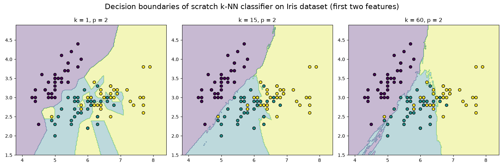

# k-Nearest Neighbour

---
#### TODO
1. Verify/quantify/visualize: "1-NN has zero training error and tends to overfit noise".

---

### Roadmap
| Part | Topic                                                    | Coding-Style |
|------|----------------------------------------------------------|--------------|
| 1    | 1-NN, Voronoi, k-NN classification/regression, Minkowski | From-scratch |

 k-Nearest Neighbour (k-NN) is a **lazy, instance-based, non-parametric** learner.
 - **Lazy**: there is no training phase. "Fitting" just stores the dataset.
 - **Instance-based**: predictions come directly from stored examples, not from a learned parametric model.
 - **Non-parametric**: model complexity grows with the data (there is no fixed weight vector).

Given a query point x, the algorithm:
1. Computes the distance $d(x, x_{i})$ to every training point $x_{i}$.
2. Selects the k-closest, forming the neighbourhood $N_{k}(x)$.
3. Predicts:
   - **Classification**: majority vote, $\hat{y} = argmax_{c} \sum_{i \in N_{k}(x)} 1[y_{i} = c]$
   - **Regression**: average, $\hat{y} = \frac{\sum_{i \in N_{k}(x)} y_{i}}{k}$

The 1-NN decision boundary is the **Voronoi tesselation** of the training set, which is why 1-NN has zero training error and tends to overfit noise.
Increasing $k$ smooth the boundary.

#### Distance metrics
The Minkowski family: $d_{p}(x, z) = (\sum_{j} |x_j - z_j|^p)^{1/p}$, where $j \in [1, D]$ indexes the features of size $D$.
- $p = 1$: Manhattan
- $p = 2$: Euclidean
- $\lim_{p \to \infty}$: Chebyshev
- $\lim_{p \to 0^+}$: Hamming

The reason why the Minkowski family is used is that it generalizes many distance metrics: different values of $p$ can capture different notions of distance.

> The metric is the real "model" in k-NN.
> Different metrics encode different notions of similarity.

---
## Lab 1
Write k-NN from scratch and validate it against scikit-learn on Iris and visualize how $k$ changes the decision boundary.

#### Notes on implementation
- **numpy.argpartition**: returns array of indices that would partition an array into two parts: the k smallest elements and the rest. This is useful for efficiently finding the k-nearest neighbors without fully sorting the distances.
- **Counter.most_common(n)**: returns a list of the n most common elements and their counts; e.g., `Counter([1, 2, 2, 3]).most_common(1)` returns `[(2, 2)]`, which is useful for finding the majority class among the k-nearest neighbors.

#### Limitations and issues of the approach
- The sum in the distance metric treats every feature equally, so a feature with a large numerical range contributes much more to the total than the other **unless you standardise**.

### Exercises
1. **Tie-breaking**: with an even $k$ and two classes, votes can tie. Implement distance-based tie-breaking (pick the class of the closest tied neighbour) and compare.
2. **Metrics**: run the classifier with $p = 1, 2$ and _large_ $p$. Does accuracy change on Iris? On a dataset with very different feature scales (e.g., `load_wine`)? Why? How can you fix it?
3. **Complexity**: time `predict` as the training set grows (1k, 10k, 1000k points). What is the cost per query, and why is k-NN cheap to train bu expensive at test time?
4. **Predict before you run**: for $k=1$, what is the training accuracy, and why?

##### 1. Tie-breaking
To break ties here two approaches are proposed:
- **Nearest-neighbour tie-break**
- **Distance-weighted voting**: (e.g., $w_i = \frac{1}{d(x, x_i)}$)

**Nearest-neighbour tie-break**
> `Counter.most_common(n)` returns a list of the n most common elements and their count.
> **Elements with equal counts are ordered in the order first encountered.**

To break ties, we can sort the k-nearest neighbors by distance and then use `Counter.most_common(n)` to find the majority class. If there is a tie, the class of the closest neighbor will be chosen.
_On rounded-discretized datasets, ties may still happen if the distance is the same._

---

# References
- [NumPy - numpy.argpartition](https://numpy.org/devdocs/reference/generated/numpy.argpartition.html)
- [NumPy - numpy.meshgrid](https://numpy.org/devdocs/reference/generated/numpy.meshgrid.html)
- [NumPy - numpy.linspace](https://numpy.org/doc/stable/reference/generated/numpy.linspace.html)
- [NumPy - numpy.ravel](https://numpy.org/doc/2.3/reference/generated/numpy.ravel.html)
- [NumPy - numpy.c_](https://numpy.org/devdocs/reference/generated/numpy.c_.html)
- [Python Collections - Counter](https://docs.python.org/3/library/collections.html#collections.Counter)
- [Python Functions - zip](https://docs.python.org/3.3/library/functions.html#zipd)
- [Scikit-learn - train_test_split](https://scikit-learn.org/stable/modules/generated/sklearn.model_selection.train_test_split.html)
- [Scikit-learn - Iris dataset](https://scikit-learn.org/1.5/auto_examples/datasets/plot_iris_dataset.html)
- [Matplotlib - matplotlib.pyplot.subplots](https://matplotlib.org/stable/api/_as_gen/matplotlib.pyplot.subplots.html)
